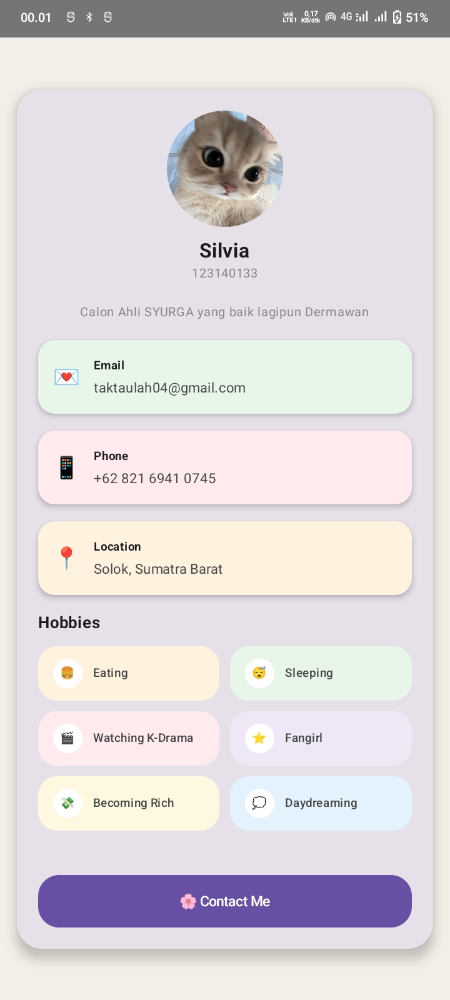

# 📱 MyProfileApp — PAM3

## Student Profile Application
**Course:** Pengembangan Aplikasi Web  
**Class:** RB  

Project ini merupakan tugas **PAM3 (Pertemuan 3)** pada mata kuliah **Pengembangan Aplikasi Web** yang bertujuan membuat aplikasi profil sederhana menggunakan **Compose Multiplatform**.

Aplikasi ini menampilkan informasi profil mahasiswa dalam tampilan **UI card yang rapi dan estetik**, serta menerapkan konsep **Composable Functions yang reusable**.

---

## 👤 Student Information

| Data | Keterangan |
|-----|------------|
| Nama | Silvia |
| NIM | 123140133 |
| Kelas | RB |
| Mata Kuliah | Pengembangan Aplikasi Web |

---

## 📌 Deskripsi Aplikasi

Aplikasi ini menampilkan halaman profil mahasiswa yang berisi:

- Foto profil
- Nama dan NIM
- Deskripsi singkat
- Informasi kontak (Email, Phone, Location)
- Hobi dalam bentuk chip card
- Tombol **Contact Me**

Aplikasi dibuat menggunakan **Jetpack Compose / Compose Multiplatform** sehingga setiap komponen UI dibuat dalam bentuk **Composable Function yang reusable**.

---

## 🧩 Reusable Composable Components

Beberapa komponen composable yang digunakan:

- **ProfileHeader**  
  Menampilkan foto profil, nama, dan NIM.

- **InfoItem**  
  Menampilkan informasi kontak seperti email, phone, dan location.

- **ProfileCard**  
  Komponen utama yang membungkus seluruh informasi profil.

- **HobbySection**  
  Menampilkan daftar hobi pengguna.

- **HobbyChip**  
  Komponen kecil untuk menampilkan satu hobi dengan ikon.

---

## 🖼️ Tampilan Aplikasi

Berikut adalah hasil tampilan aplikasi:

---

## 🛠️ Teknologi yang Digunakan

- Kotlin
- Compose Multiplatform
- Material 3
- Android Studio

---

⭐ Project ini dibuat sebagai bagian dari tugas **Pengembangan Aplikasi Web (PAM3)**.
