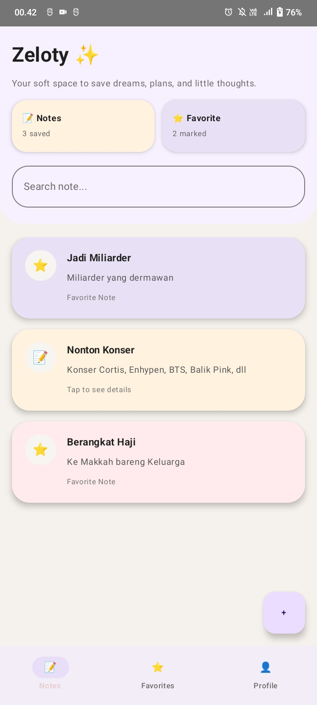
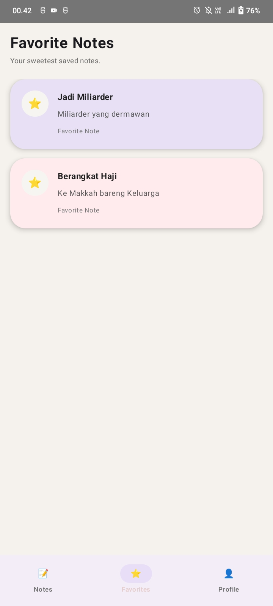
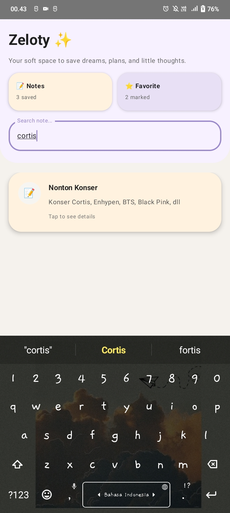
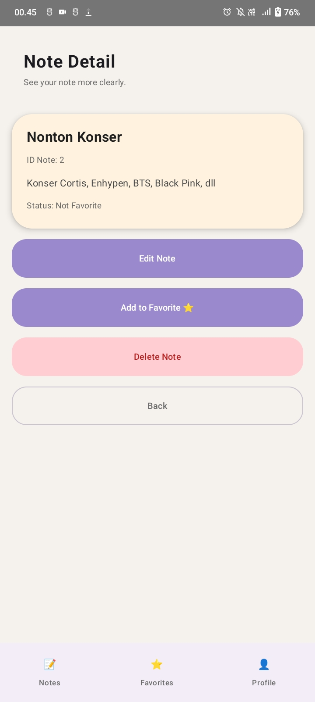
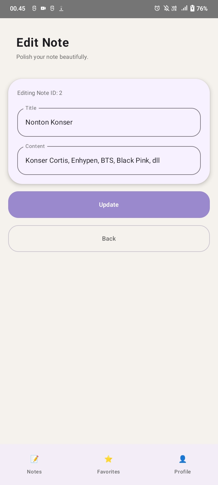
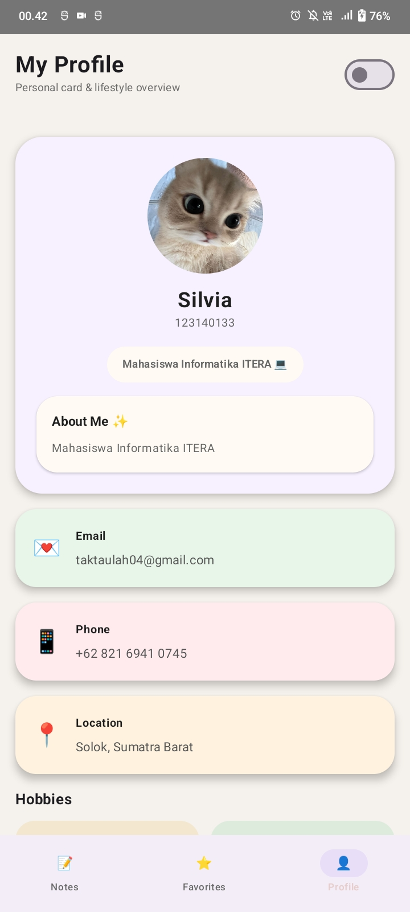

# 💌✨ Zeloty Diary App ✨💌
### 📱 Tugas PAM – Pengembangan Aplikasi Mobile 💖

---

## 👩‍🎓💖 Identitas Mahasiswa 💖👩‍🎓
- 🌸 **Nama** : Silvia  
- 🎓 **NIM** : 123140133  
- 🏫 **Kelas** : RB  
- 📚 **Mata Kuliah** : Pengembangan Aplikasi Mobile  

---

## 🌸✨ Tentang Aplikasi Ini ✨🌸
Zeloty Diary App adalah aplikasi diary digital yang:
💌 bisa nyimpen cerita harian  
💭 bisa ngelihat kembali kenangan  
📱 simple dan sederhana  

---

## 🛠️💻 Teknologi yang Dipakai 💻🛠️
- 🟣 Kotlin  
- 🎨 Jetpack Compose  
- 🗄️ SQLDelight (Local Database)  
- 🔀 Navigation Compose  

---

## 🎯💖 Fitur Lucu Aplikasi 💖🎯
✨ fitur-fitur gemoy:
- ➕ nambah diary 💌  
- 📋 lihat semua catatan 🥺  
- 🔄 sorting newest / oldest 🔁  
- 💾 simpan otomatis ke database  

---

## 📸💗 Tampilan Aplikasi 💗📸

### 🌸 Preview Lucu 🌸
<table>
  <tr>
    <td></td>
    <td></td>
    <td></td>
  </tr>
  <tr>
    <td></td>
    <td></td>
    <td></td>
  </tr>
</table>

---

## 📂✨
